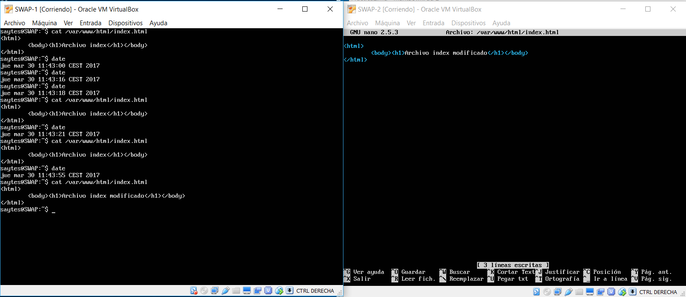

## SWAP
### Práctica 2 - Jorge Gutiérrez Segovia

### IP de mis Máquinas Virtuales

SWAP-1: 10.0.2.15  - SWAP-2: 10.0.2.4

###Instalación de rsync

En mi caso no tengo que instalar rsync, ya que viene instalado en servidores de ubuntu con versión 16.04, pero el comando para instalarlo es:

`sudo apt-get install rsync`
	
Una vez realizado, tenemos que modificar el propietario de el directorio /var/www/ en ambas máquinas:

`sudo chown saytes:saytes -R /var/www/`

Una vez hecho esto podemos ver si funciona el comando:

`rsync -avz -e ssh 10.0.2.4:/var/www/ /var/www/`

Tras hacer esto nos informa de que la conexión no puedes ser establecida porqué tiene una clave de acceso, a lo que después nos preguntará que si queremos seguir conectándonos, por lo que escribimos yes.
Después de escribir yes, nos preguntará la contraseña de la máquina a la que queremos conectarnos, y si la escribimos correctamente, estaremos conectados a la máquina mediante SSH.

###Conexión mediante SSH sin Contraseña

Par poder automatizar el proceso, y que no nos este pidiendo la contraseña cada vez que ejecutamos la orden anterior, vamos a generar un par de claves rsa que servirán para conectarse sin contraseña.

Todas las órdenes van a ser introducidas en la Maquina SWAP-2: 

1. `ssh-keygen -b 4096 -t rsa ` cuando nos pregunte por la contraseña dejamos el campo vacío.
2. ssh-copy-id 10.0.2.15
3. Introducimos por ultima vez contraseña SSH

Y ya podríamos conectarnos sin poner la contraseña desde la máquina SWAP-2 a la máquina SWAP-1, por lo que ejecutando los comandos anteriores de la siguiente forma podríamos hacerlo también a la inversa:

1.  `ssh-keygen -b 4096 -t rsa ` cuando nos pregunte por la contraseña dejamos el campo vacío.
2. ssh-copy-id 10.0.2.4
3. Introducimos por ultima vez contraseña SSH

Una vez hecho esto, ya podríamos conectarnos entre máquinas sin introducir ninguna contraseña.

### Automatización con Crontab

Una vez que ya que tenemos el acceso sin contraseña, vamos a proceder a que la máquina SWAP-1 realice una copia cada minuto por ejemplo, debemos editar el archivo /etc/crontab:

	sudo nano /etc/crontab

Y debemos añadir esta linea:

	* * * * * saytes rsync -avz -e ssh 10.0.2.4:/var/www/ /var/www/

Ahora debemos recargar cron, para que vuelva a cargar el fichero de tareas:

	sudo /etc/init.d/cron reload

Ahora nuestro sistema de copia automática esta realizará la copia automática.

