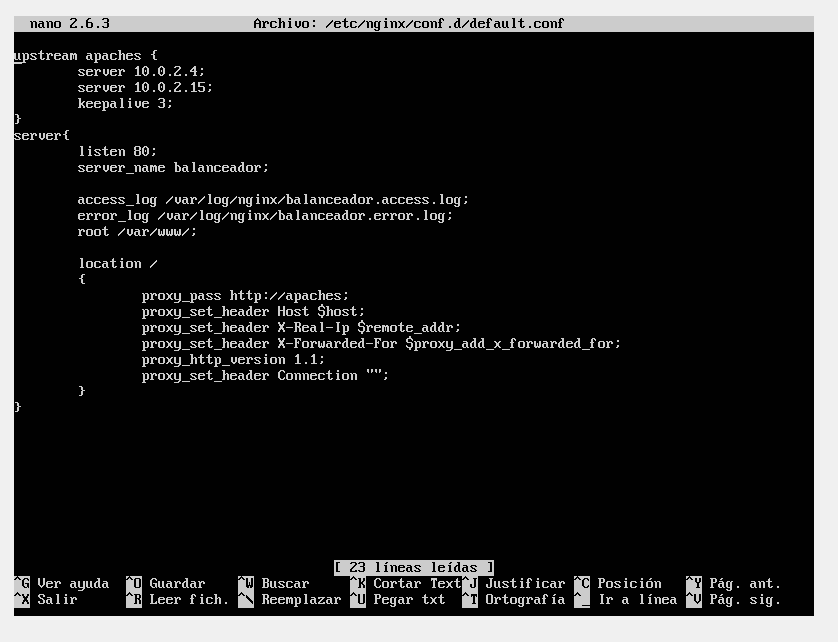
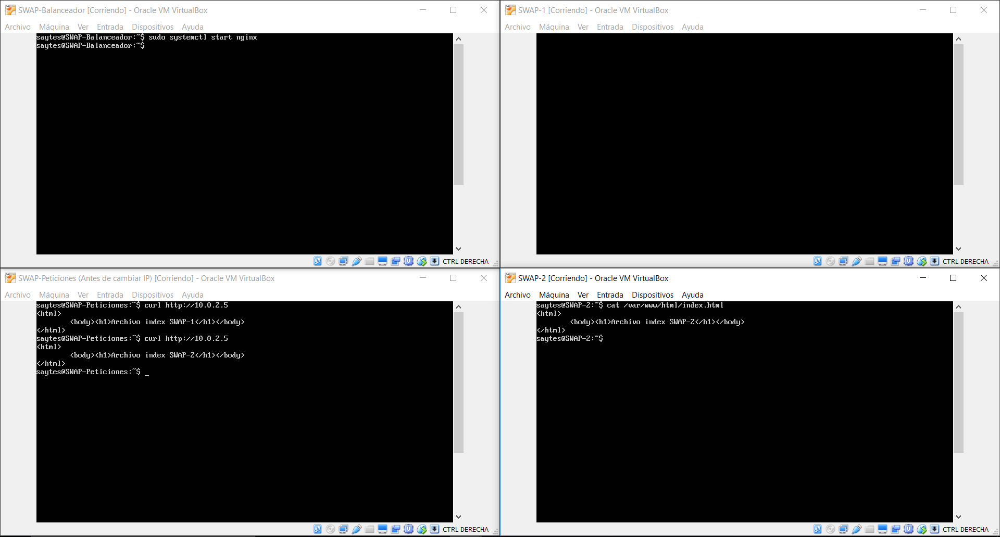
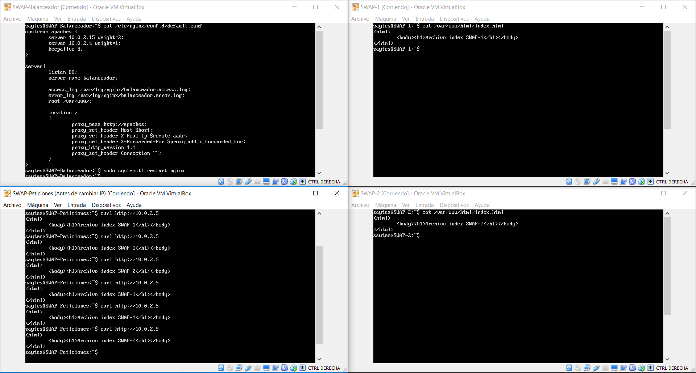
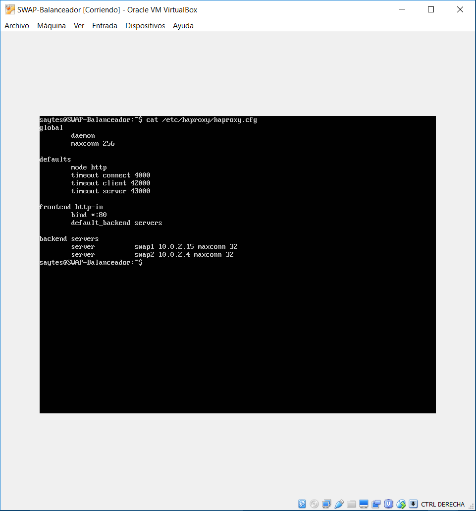
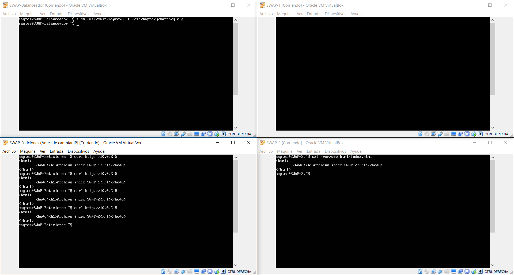

## SWAP
### Práctica 3 - Jorge Gutiérrez Segovia

### IP de mis máquinas

| SWAP 1  	 | SWAP 2 	  | Balanceador |
| ---------- | ---------- | ----------  |
| 10.0.2.15  | 10.0.2.4   | 10.0.2.5	|

| Peticiones | Balanceador |
| ---------- | ----------  |
| 10.0.2.7   | 10.0.2.5	   |

### Instalación nginx

Tras instalar dos máquinas virtuales adicionales a las dos de las anteriores prácticas, una para el balanceador de carga(sin apache) y otra para hacer las peticiones, abrimos la máquina destinada a ser el balanceador y le instalamos nginx con el siguiente comando:

`sudo apt-get install nginx`

Una vez instalado si hacemos el siguiente comando, se iniciará:

`sudo systemctl start nginx`

###Configuración de nginx

Una vez instalado nginx, vamos a pasar a configurar, para ello vamos a editar su archivo de configuración situado en 

`/etc/nginx/conf.d/default.conf`

Borramos toda la configuración que haya, ya que no nos sirve y empezamos a configurar el fichero.

Una vez configurado, vamos a intentar hacer CURL a las dos máquinas que intentamos balancear.

Tal y como se ve en la imagen, funciona perfectamente.

Si modificamos el valor weight para que la máquina SWAP-1 reciba más tráfico que la máquina SWAP-2:

De tal forma que como está configurado, la máquina SWAP-1 recibe el doble de peticiones que la máquina SWAP-2.

###Instalación de haproxy

Para instalar haproxy debemos ejecutar el siguiente comando:

`sudo apt-get install haproxy`

Una vez instalado vamos a para el servicio nginx:

`sudo systemctl stop nginx`

###Configuración haproxy

Para configurar haproxy debemos modificar el archivo:

`/etc/haproxy/haproxy.cfg`

Una vez hecha la configuración vamos a pasar a iniciar haproxy mediante el comando:

`sudo /usr/sbin/haproxy -f /etc/haproxy/haproxy.cfg` 

Tras haber iniciado el servicio, probamos que está funcionando correctamente

###Carga de los servidores

Como ahora mismo el servicio de haproxy está funcionando, vamos a someterle primero a carga, para ello ejecutamos el siguiente comando:
(La IP del balanceador es 10.0.2.5)

`for i in {0..9}; do ab -n 10000 -c 10 http://10.0.2.5 > datos/haproxy/haproxy_ab_$i.txt; done`

Una vez hecho esto, vamos a parar el servicio de haproxy en el balanceador y vamos a iniciar nginx, para ello ejecutamos el siguiente comando:

`sudo service haproxy stop`

Aunque tras esto no se paró, así que tuve que abrir top, encontrar el pid de haproxy y después hacer 

`kill pid`

(en mi caso fueron 1743 y 1301)

Ahora iniciamos nginx,

`sudo systemctl start nginx`

y hacemos la prueba de carga con Apache
Benchmark en el balanceador:
(La IP del balanceador es 10.0.2.5)

`for i in {0..9}; do ab -n 10000 -c 5 http://10.0.2.5 > datos/nginx/nginx_ab_$i.txt; done`

Ya tenemos los tiempos cada uno de los balanceadores, así que ahora los comparamos:

| ab	                         | nginx    | haproxy  |
| :----------------------------: | :------: | -----:   |
| Tiempo total para los test (s) | 25,904   | 32.843   |
| Peticiones totales             | 38619.98 | 30451.77 |

Por lo que podemos confirmar que nginx sale victorioso en esta comparación, resolviendo más peticiones en menos tiempo.
