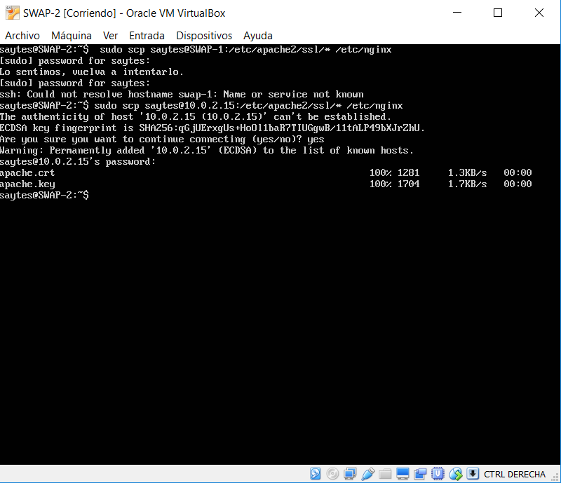
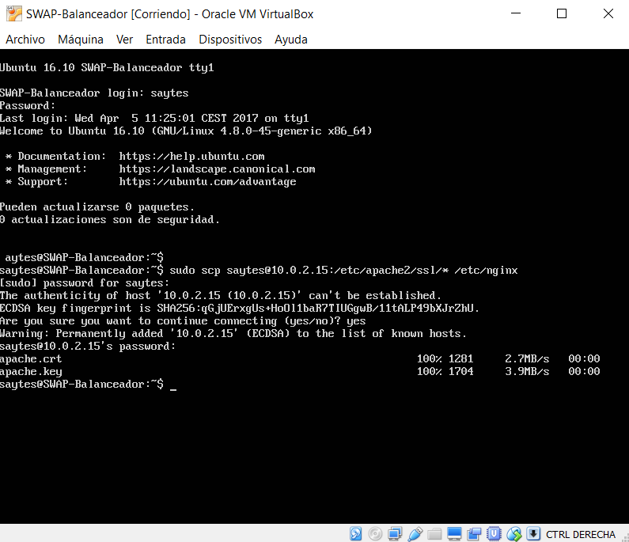
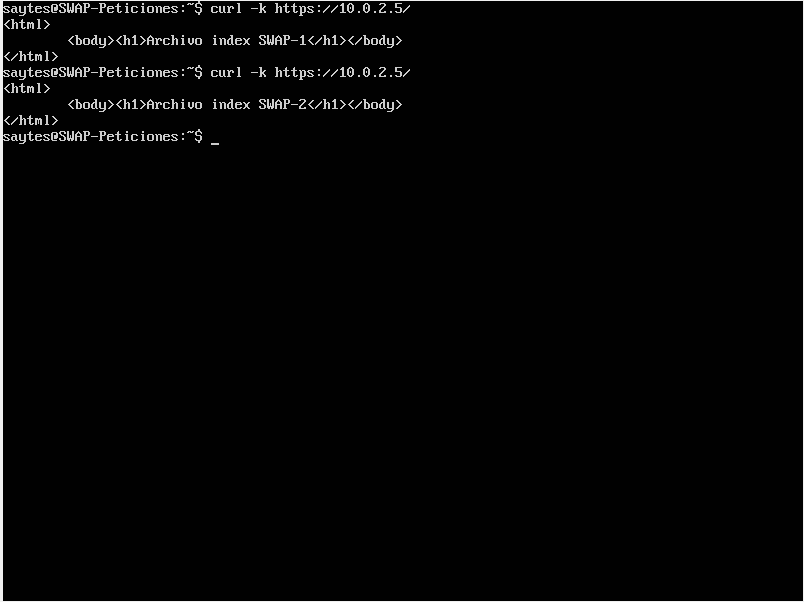
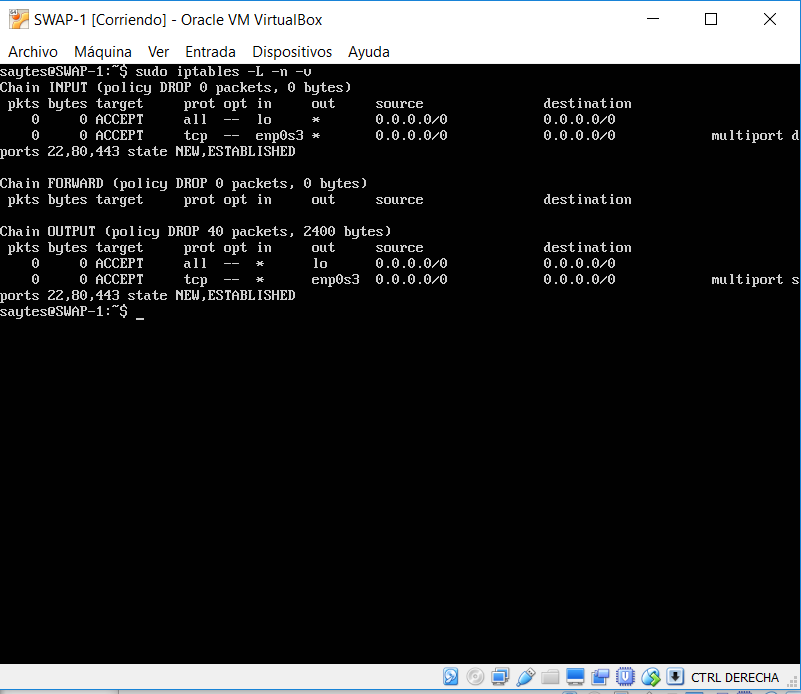

## SWAP
### Práctica 4 - Jorge Gutiérrez Segovia

### IP de mis máquinas

| SWAP 1  	 | SWAP 2 	  | Balanceador |
| ---------- | ---------- | ----------  |
| 10.0.2.15  | 10.0.2.4   | 10.0.2.5	|

| Peticiones | 
| ---------- |
| 10.0.2.7   |

### Configuración de certificados HTTP
####Generación del certificado en SWAP 1

Generaremos el certificado en una de las máquinas, y luego lo copiaremos a las demás.
Para crear el certificado en la máquina debemos utilizar los siguientes comandos:

	a2enmod ssl
	service apache2 restart
	mkdir /etc/apache2/ssl
	openssl req -x509 -nodes -days 365 -newkey rsa:2048 -keyout /etc/apache2/ssl/apache.key -out /etc/apache2/ssl/apache.crt

Ahora en el directorio /etc/apache2/ssl tenemos el certificado y la clave. Posteriormente deberemos copiarlas tanto a SWAP-2 como a Balanceador

####Configuración de Apache para SSL
Para que funcione correctamente, debemos añadir dos líneas en el archivo `/etc/apache2/sites-avalible/default-ssl` debajo de la línea donde pone SSLEnable on:
	
	SSLCertificateFile /etc/apache2/ssl/apache.crt
	SSLCertificateKeyFile /etc/apache2/ssl/apache.key

Una vez hecho eso, activamos y reiniciamos:
	
	a2ensite default-ssl
	service apache2 reload

####Configurar NGINX para usar SSL
Antes de configurar NGINX en el balanceador toca copiar el certificado a las otras máquinas, para ello voy a usar SCP. La sintaxis de este comando es:

`sudo scp usuario@IPMaquina:/dirOrigen /dirDestino`

En mi caso:

`sudo scp saytes@10.0.2.15:/etc/apache2/ssl/* /etc/nginx`

Para la máquina SWAP-2:

Y para el balanceador:

Una vez copiado en el balanceador, nos vamos a la ruta del archivo de configuración de NGINX `/etc/nginx/conf.d/default.conf` y añadimos lo siguiente dentro de server:

	listen 443 ssl;
	ssl on;
	ssl_certificate apache.crt;
	ssl_certificate_key apache.key;

Y después de ello, reiniciamos NGINX y ya funcionará con nuestro certificado SSL.

`sudo service nginx reload`

####Configuración de IPTABLES en ambas máquinas

En la configuración de las SWAP-1 y SWAP-2 debemos permitir su comunicación por el puerto 22,80 y 443.
Para ello vamos a crear un fichero con su configuración automática:

`sudo nano /home/saytes/conf_iptables.sh`

Una vez abierto, añadimos lo siguiente:
	
	# Eliminar todas las reglas (configuración limpia)
		iptables -F
		iptables -X
		iptables -Z
		iptables -t nat -F
	# Política por defecto: denegar todo el tráfico
		iptables -P INPUT DROP
		iptables -P OUTPUT DROP
		iptables -P FORWARD DROP
	# Permitir cualquier acceso desde localhost (interface lo)
		iptables -A INPUT -i lo -j ACCEPT
		iptables -A OUTPUT -o lo -j ACCEPT
	# Abrir los para permitir el acceso
		iptables -A INPUT -i enp0s3 -p tcp -m multiports --dports 22,80,443 -m state --state NEW,ESTABLISHED -j ACCEPT
		iptables -A OUTPUT -o enp0s3 -p tcp -m multiports --sports 22,80,443 -m state --state NEW,ESTABLISHED -j ACCEPT

Una vez creado el script vamos a programarlo para que se ejecute en cada inicio del sistema, para ello voy a crear un servicio en systemd.

Creo un archivo nuevo:

`sudo nano /etc/systemd/system/iptables.service`

Y dentro programo lo siguiente:

	[Unit]
	Description=Configurar IPTABLES
	After=syslog.target
	
	[Service]
	Type=forking
	ExecStart=/home/saytes/iptables_conf.sh
	
	[Install]
	wantedBy=multi-user.target

Después, cambiamos los permisos de ejecución de ambos archivos:
	
	sudo chmod +x /etc/systemd/system/iptables.service
	
	sudo chmod +x /home/saytes/conf_iptables.sh

Una vez hecho esto, vamos a ejecutar los siguientes comandos para que se inicie con systemctl cada vez que se arranque el servidor.

	sudo systemctl daemon-reload
	sudo systemctl start iptables.service
	sudo systemctl status iptables.service
	sudo systemctl enable iptables.service

Y ya se ejecutaría cada vez que se inicie sesión.

###Práctica funcionando

