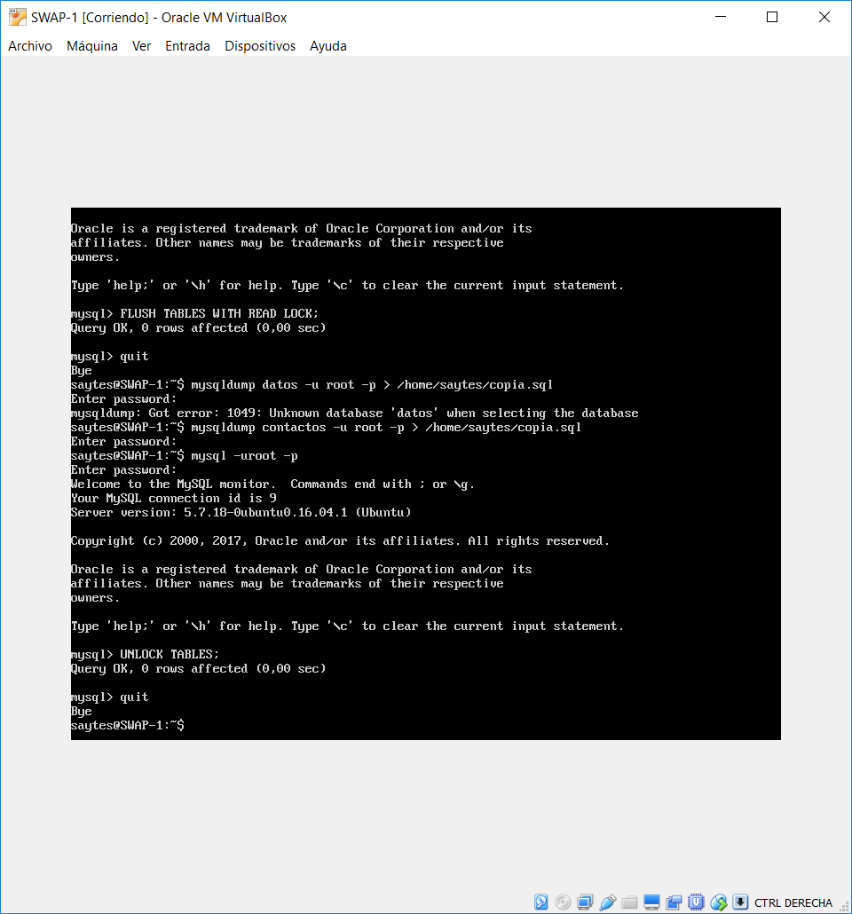
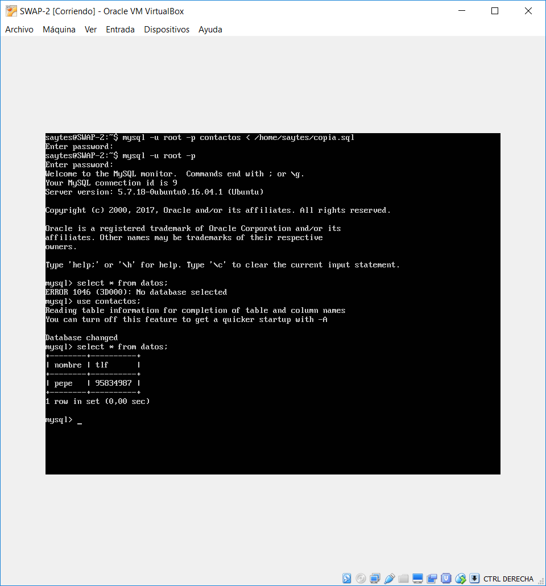
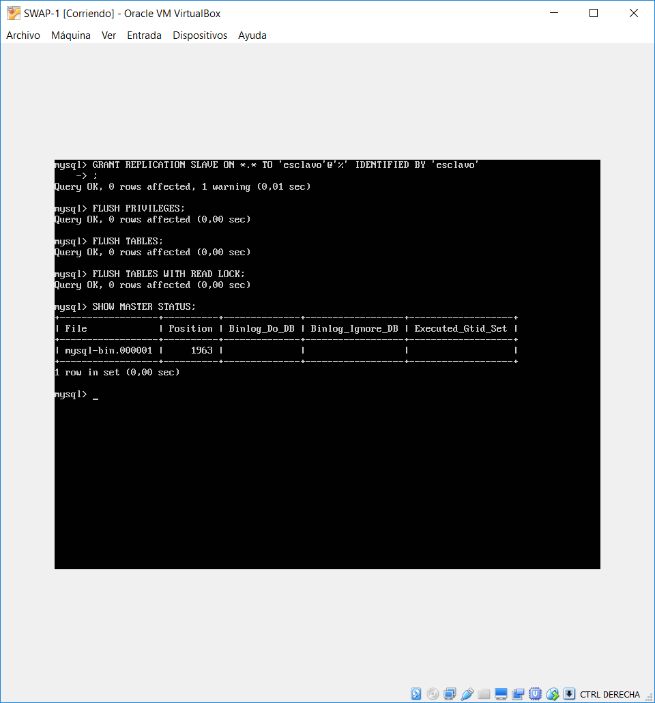
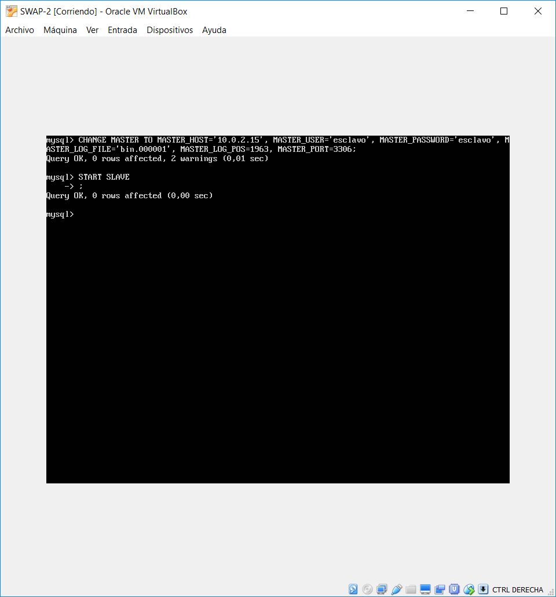
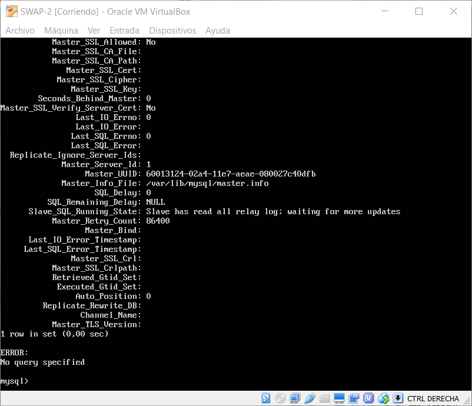

## SWAP
### Práctica 5 - Jorge Gutiérrez Segovia

### IP de mis máquinas

| SWAP 1  	 | SWAP 2 	  | Balanceador |
| ---------- | ---------- | ----------  |
| 10.0.2.15  | 10.0.2.4   | 10.0.2.5	|

| Peticiones | 
| ---------- |
| 10.0.2.7   |

##Creación de la Base de Datos

Lo primero que voy a hacer es crear una base de datos en la máquina SWAP 1.

Para ello, introduzco el comando `mysql -uroot -p ` para entrar en la línea de comandos de mysql con permisos de root.

Una vez dentro creamos una database, a la que llamaré contactos, con el siguiente comando:

`create database contactos;`

Después, le diremos a mysql que vamos a usar esa database, de la siguiente forma:

`use contactos`

Si hacemos `show tables` se mostrarán las tablas de nuestra base de datos, las cuales ahora mismo estarán vacías.

Posteriormente, vamos a  crear una tabla, la cual contendrá un nombre con un máximo de 100 caracteres y un teléfono:

`create table datos(nombre varchar(100), tlf int);`

Si ahora ejecutamos `show tables` podremos ver nuestra tabla.

Ahora, vamos a insertar una columna a esta:

`inster into datos(nombre,tlf) values("pepe",95834987);`

Y por último vamos a ver todas las columnas de nuestra tabla:

`select * from datos;`

##Replicar la Base de Datos con mysqldump

Después de crear la base de datos en nuestra primera máquina, vamos a clonarla a la segunda, para ello seguiremos los siguientes pasos en cada una de las máquinas.

SWAP 1:

- Antes de copiarla, restringimos el acceso para evitar que los datos cambien mientras se clona.
- Después, copiamos la base de datos en alguna dirección de la misma máquina.
- Finalmente, desbloqueamos la base de datos.

SWAP 2:

- Copiamos la base de datos creada en SWAP 1.
- Si es la primera vez, tendremos que crear una base de datos, aunque este vacía, para poder restaurarlos.
- Después restauramos los datos.

Dicho esto, vamos a clonarla.

###Comandos en la Máquina SWAP 1.

Bloqueo de la base de datos.

- `mysql -u root -p`
- `FLUSH TABLES WITH READ LOCK;`
- `quit`
 
Copia de la base de datos.

- `mysqldump contactos -u root -p > /home/saytes/copia.sql;`

Desbloqueo de la base de datos.

- `mysql -u root -p`
- `UNLOCK TABLES;`
- `quit`
 

###Comandos en la Máquina SWAP 2.

Copia de la backup de la base de datos de la máquina SWAP 1.

`scp saytes@10.0.2.15:/home/saytes/copia.sql /home/saytes`

Creamos una base de datos vacía.

- `mysql -u root -p`
- `create DATABASE contactos`
- `quit`

Restauramos la copia

`mysql -u root -p contactos < /home/saytes/copia.sql`

##Replica de una Base de Datos mediante configuración maestro-esclavo

###Configuración maestro-esclavo

En la máquina SWAP 1, edito el archivo de configuración */etc/mysql/mysql.conf.d/mysqld.cnf* :

- Comentamos la línea: bind-address 127.0.0.1
- Establecemos el log de errores: log_error = /var/log/mysql/error.log
- Establecemos el identificador del servidor: server-id = 1
- Establecemos el registro binario: log_bin = /var/log/mysql/mysql-bin.log
- Guardamos el documento y reiniciamos el servicio con `sudo /etc/init.d/mysql restart`

Establecemos la misma configuración en la máquina SWAP 2, salvo a que el identificador del servidor será 2 en lugar de uno.

###Creación de un usuario para replicar datos

En el maestro, iniciamos mysql y ejecutamos los comandos para crear un usuario:

- `CREATE USER esclavo IDENTIFIED BY 'esclavo;`
- `GRANT REPLICATION SLAVE ON *.* TO 'esclavo@%' IDENTIFIED BY 'esclavo';`
- `FLUSH PRIVILEGES;`
- `FLUSH TABLES;`
- `FLUSH TABLES WITH READ LOCK;`
- Comprobación : `SHOW MASTER STATUS;` 

Una vez hecho esto, introducimos el siguiente comando para decir que la máquina SWAP B será la esclava:

`CHANGE MASTER TO MASTER_HOST='10.0.2.4', MASTER_USER='esclavo', MASTER_PASSWORD='esclavo', MASTER_LOG_FILE='bin.000001', MASTER_LOG_POS=982, MASTER_PORT=3306;`

Después de esto, ejecutamos el comando `START SLAVE` y ya estaría funcionando, aunque todavía debemos desbloquear las tablas: `UNLOCK TABLES`.

Ahora si ejecutamos: `SHOW SLAVE STATUS\G;`y vemos que la configuración funciona correctamente.

Finalmente, para comprobar que funciona introducimos una columna en la Máquina 1 y vemos que en la Máquina 2 se actualice automáticamente.

