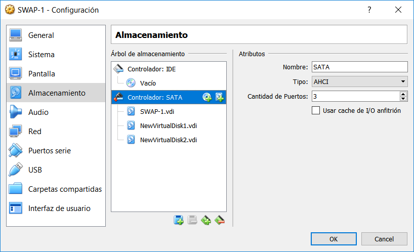
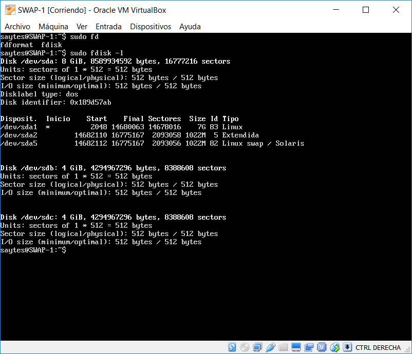
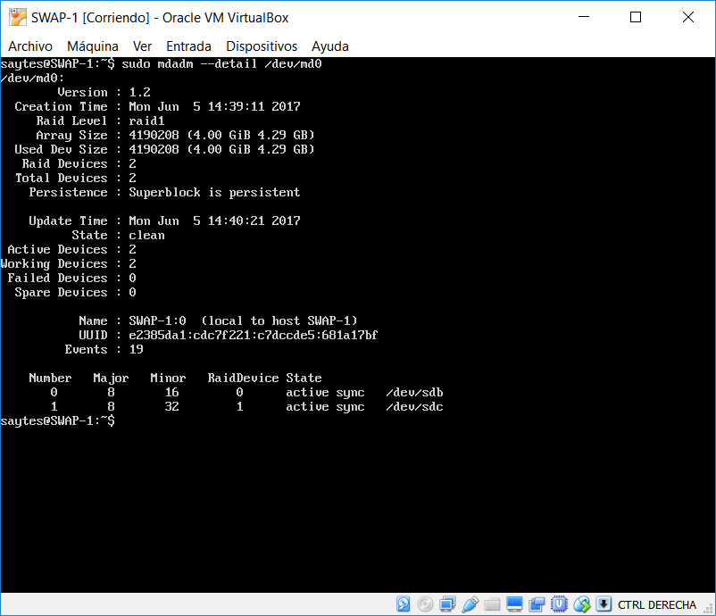
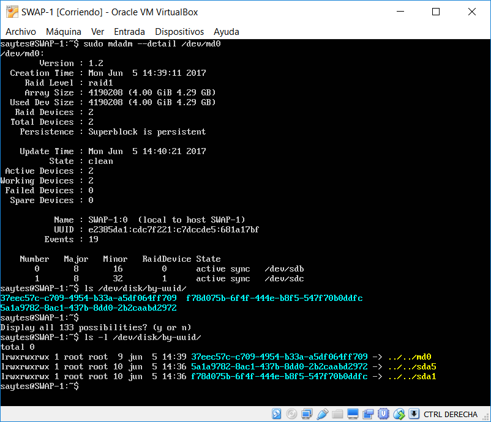
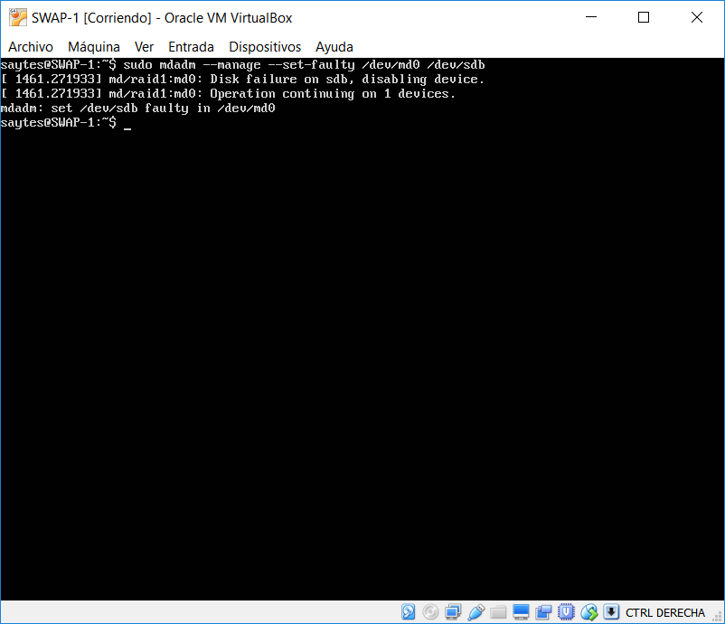
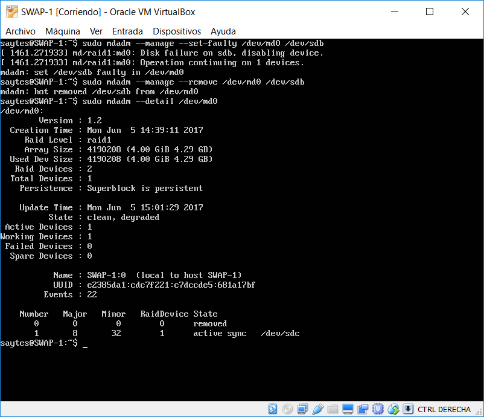
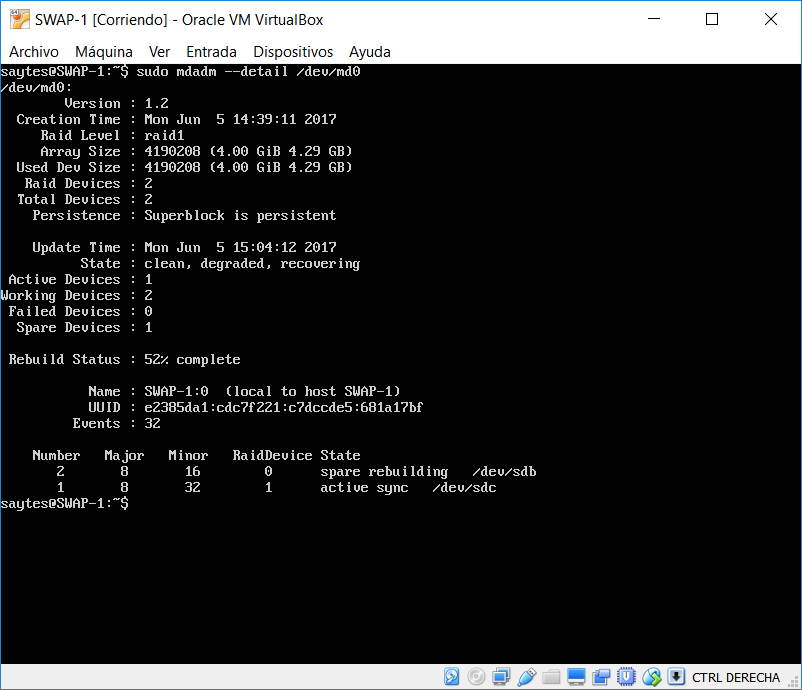
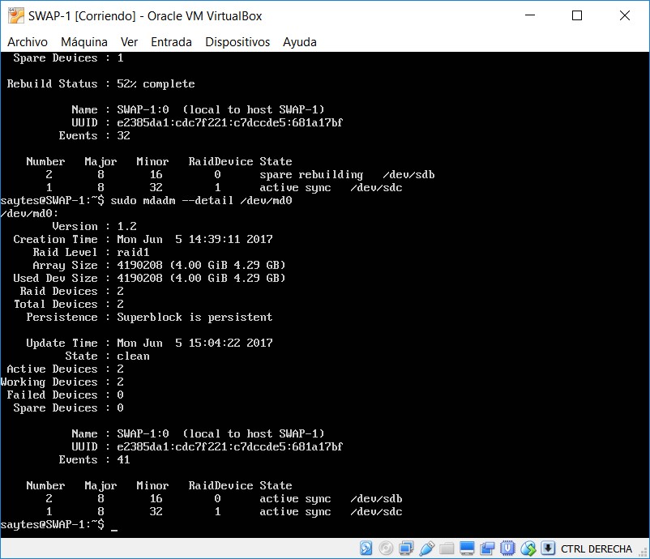

## SWAP
### Práctica 6 - Jorge Gutiérrez Segovia

### IP de mis máquinas

| SWAP 1  	 | SWAP 2 	  | Balanceador |
| ---------- | ---------- | ----------  |
| 10.0.2.15  | 10.0.2.4   | 10.0.2.5	|

| Peticiones | 
| ---------- |
| 10.0.2.7   |

##Configuración de Raid por software.

Lo primero que tenemos que hacer es crear en la máquina que queramos dos discos, los cuales utilizaremos como Raid.

Una vez creados los discos, iniciamos la máquina, y vemos si tenemos la herramienta mdadm instalada, en caso de que no la instalamos:

`sudo apt-get install mdadm`

Una vez instalada, podemos comprobar el nombre asignado a los discos por la máquina con  `sudo fdisk -l`

Una vez comprobado esto, podemos pasar a crear el raid, yo lo llamaré md0, el comando a utilizar es: 

`sudo mdadm -C /dev/md0 --level=raid1 --raid-devices=2 /dev/sdb /dev/sdc`

Siendo el segundo disco sdb y el tercero sdc.

Ahora le damos formato al raid con `sudo mkfs /dev/md0`, por defecto tendrá formato ext2.

Y una vez creado esto tenemos el raid creado y con formato, ahora podemos montarlo, para ello creo un directorio que se llama dat y lo monto dentro:

	sudo mkdir dat
	sudo mount /dev/md0 /dat

Una vez hecho esto tendremos el raid montado en /dat.

Si queremos comprobar el estado del raid, podemos hacerlo usando el comando: `sudo mdadm --detail /dev/md0`

En esa imagen vemos que el raid está activo.

##Automatización del montaje del Raid

Vamos a automatizar el montaje del raid en cada inicio del sistema, para ello editaremos el archivo */etc/fstab* y añadiremos una línea para que este lo haga.

Lo primero que vamos a hacer es identificar el UUID del Raid, para ello ejecutamos ` ls -l /dev/disk/by-uuid/`.

De forma que para automatizar el montaje añadimos a fstab la siguiente línea:
	
	UUID=37eec57c-c709-4954-b33a-a5df064ff709 /dat ext2 defaults 0 0

##Simular fallo en los discos

Provocaremos un fallo en uno de los discos que componen el RAID, retirándolo mientras está en uso con los comandos:

`sudo mdadm --manage --set-faulty /dev/md0 /dev/sdb`

`sudo mdadm --manage --remove /dev/md0 /dev/sdb`

Ahora mismo tendríamos solo uno de ambos discos funcionando.

`sudo mdadm --manage --add /dev/md0 /dev/sdb`

Finalmente, si añadimos de nuevo el disco, mdadm se encargará de restablecerlo , en la imagen anterior vemos como va por el 52%, todo eso mientras se puede usar el otro disco.

Aquí ya podemos apreciar que se ha restablecido todo con éxito y los dos discos pasan a estar funcionando de nuevo.